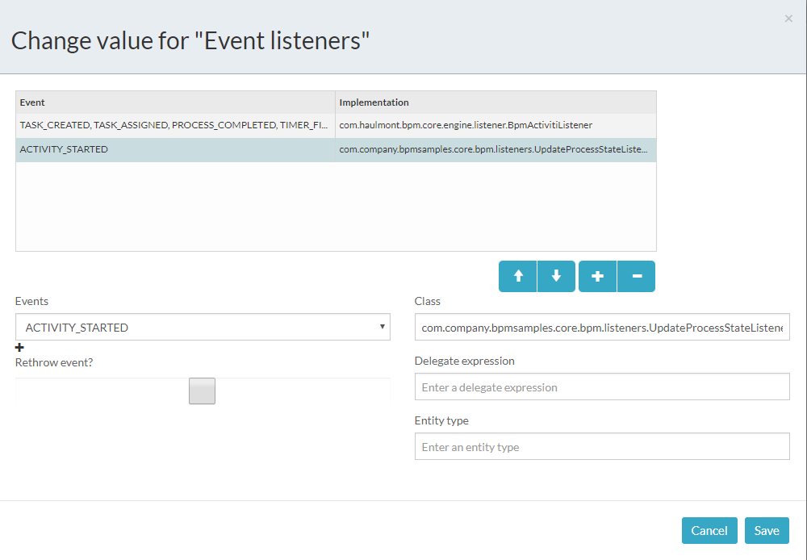

# BPM Samples

## Overview

This project contains few samples that demonstrate how to use different components of the BPM addon.

The project is based on CUBA Platform 6.9.0.  

## How To Get Started With This Project

1. Import the project using the CUBA Studio
1. Run the project. The models JSONs are located under the [modules/core/web/WEB-INF/resources/models](modules/core/web/WEB-INF/resources/models) directory. They will be automatically deployed by the [ModelDeployer.java](modules/core/com/company/bpmsamples/core/bpm/ModelDeployer.java) on application startup.  

## Samples

### Contract Approval Sample

The sample demonstrates the usage of custom process forms. To test it, open the `Application - Contracts` screen, create a new contract instance and start the process using the `ProcActionsFrame`. The custom process form will be displayed.
 
Process form XML descriptor: [start-contract-approval-form.xml](modules/web/src/com/company/bpmsamples/web/forms/contract/start-contract-approval-form.xml)

Process form Java controller: [StartContractApprovalForm.java](modules/web/com/company/bpmsamples/web/forms/contract/StartContractApprovalForm.java)

Contract editor XML descriptor: [contract-edit.xml](modules/web/com/company/bpmsamples/web/contract/contract-edit.xml)

Contract editor Java controller: [ContractEdit.java](modules/web/com/company/bpmsamples/web/contract/ContractEdit.java)

Process model name: `Contract approval - 1`

Application screen: `Application - Contracts` 

Before the process form may be used, it must be registered in the process forms configuration file: [app-bpm-forms.xml](app-bpm-forms.xml)

The `start-contract-approval-form` form functions:
 
 1. displays the information about the passed contract
 1. displays the component for entering a timer period (after this period is over, the contract must be automatically approved). The form sets the process variable with the time value that is used in the boundary timer event of the process model
 1. displays the `ProcActorsFrame` for selecting process actors
 
 To be able to display the contract entity information in the process form, the contract entity must be passed to the form. In the current sample the `ProcActionsFrame` is used for working with process actions. The `ProcActionsFrame` has method `setStartProcessActionScreenParametersSupplier()` to specify form parameters supplier:

```java
procActionsFrame.initializer()
    //...
    .setStartProcessActionScreenParametersSupplier(() -> {
        Map<String, Object> screenParams = new HashMap<>();
        screenParams.put("contract", getItem());
        return screenParams;
    })
    //...
```

In the `start-contract-approval-form.xml`, you may get the `contract` parameter as a regular window parameter:

```java
@WindowParam(required = true)
private Contract contract;
```

The `getFormResult()` method returns a list of process variables that will be assigned to the Activiti process instance after the form is commited.

```java
@Override
public Map<String, Object> getFormResult() {
    HashMap<String, Object> processVariables = new HashMap<>();
    processVariables.put("automaticApprovalPeriod", makeTimerExpression(automaticApprovalPeriodField.getValue()));
    return processVariables;
}
``` 

See the comments in the entity editor and process form source code for details.

### Task Execution Sample

This sample demonstrates the following:

* How to create process actors on process start using the `ProcActionsFrame`
* How to pass process variables to the process instance using the `ProcActionsFrame`
* How to get and modify standard process actions created by the `ProcActionsFrame`
* How to start a process without the `ProcActionsFrame`
* How to automatically update the `processState` field using the `ActivitiEventListener`

The Task entity editor XML descriptor: [task-edit.xml](modules/web/com/company/bpmsamples/web/task/task-edit.xml)

The Task entity editor Java controller: [TaskEdit.java](modules/web/com/company/bpmsamples/web/task/TaskEdit.java)

The menu item: `Application - Tasks`

The process model: `Task execution -1`

In this process we don't use the `StandardProcForm` to assign process actors. We do it with the help of the before start process predicate of the `ProcActionsFrame`.

See the `setBeforeStartProcessPredicate()` method usage in the [TaskEdit.java](modules/web/com/company/bpmsamples/web/task/TaskEdit.java)   

See the `setStartProcessActionProcessVariablesSupplier()` usage in the [TaskEdit.java](modules/web/com/company/bpmsamples/web/task/TaskEdit.java) as an example of how to pass process variables at process start using the `ProcActionsFrame`. The `acceptanceRequired` process variable will be used by one of process gateways.

The `changeStartProcessBtnCaption()` demonstrates that you can get and modify process actions generated by the `ProcActionsFrame`. 

The `startProcessProgrammatically()` method demonstrates how to start a new process instance without the `ProcActionsFrame`. See the comments in the code for details.

The [UpdateProcessStateListener.java](modules/core/com/company/bpmsamples/core/bpm/listeners/UpdateProcessStateListener.java) is an implementation of the `org.activiti.engine.delegate.event.ActivitiEventListener`. This listener is registered as a process-level listener. It does the following: each time a new process step is reached, the `processState` field of the related `com.company.bpmsamples.entity.Task` entity is updated.

That's how the process-level event listeners configuration looks like. 



To open this window click somewhere in the modeler, click the "Show advanced properties" link and then to the "Event listeners" property.

See the comments in source code for details.
